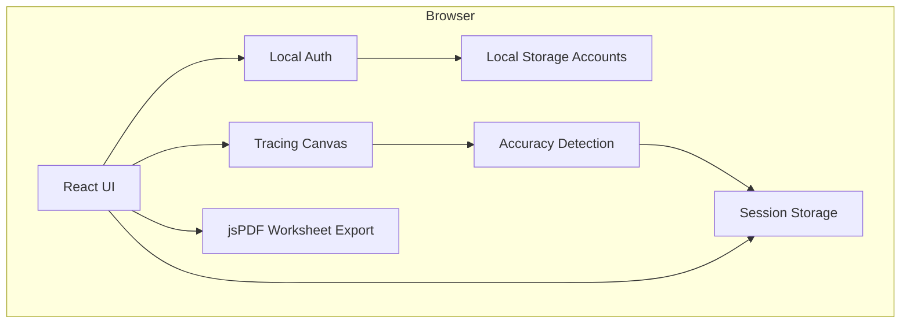

# Little Writing Buddy

Little Writing Buddy is a frontend-only handwriting practice website for young
primary school children. Students trace uppercase and lowercase letters online,
receive simple accuracy feedback, and teachers or parents can print or download
PDF worksheets for extra practice. The project is sponsored by the Department
of Education.

Visitors land on a welcome page (`/`) with product information, then continue
into the practice workspace at `/practice`.

## Main Features

- **Interactive letter tracing** — HTML Canvas with mouse, touch, and stylus input
- **A to Z letter selection** — choose any letter with uppercase or lowercase mode
- **Handwriting guides** — dotted guide letters with top, mid, baseline, and bottom lines
- **Accuracy feedback** — session score and child-friendly tips after each attempt
- **Sign-in** — name + password accounts stored in the browser; no server setup needed
- **Secure HTTP error pages** — dedicated 404 / 500 / 502 pages that hide internal details
- **Progress summary** — tries completed, best score, and badges saved in the browser tab
- **Printable worksheets** — pick letters, preview tracing rows, print or download PDF (A4)

## System Architecture

Little Writing Buddy is a static single-page application. All practice, feedback,
PDF generation, and accounts run in the browser. Accounts are stored in
`localStorage`. Session progress is stored in `sessionStorage` for the current tab.



### Project structure

```
src/
├── auth/             Local sign-in / sign-up
├── components/       UI panels + error boundary
├── content/          Visible site copy
├── data/             Letter helpers
├── hooks/            Session progress state
├── pages/            Landing, security, and HTTP error pages
├── types/            Shared TypeScript types
├── utils/            Canvas guides, accuracy scoring, PDF generation
├── App.tsx           Practice workspace layout
├── AppRouter.tsx     Routes (landing, practice, security, 404/500/502)
└── main.tsx          App entry point
```

### Technology stack

| Layer | Choice |
|-------|--------|
| UI | React 19 + TypeScript |
| Build | Vite |
| Test | Vitest + Testing Library + jsdom |
| Routing | React Router |
| Auth | Browser `localStorage` |
| Security | Safe HTTP error pages + error boundary |
| Tracing | HTML Canvas + Pointer Events |
| Worksheets | jsPDF (lazy-loaded) |
| Icons | lucide-react |
| Hosting | Static deploy (e.g. Vercel, Netlify) |

## Local Development

Install dependencies:

```bash
npm install
```

Run the development server:

```bash
npm run dev
```

Sign in / Sign up work immediately — no API keys or database setup.

### Security — HTTP error pages

Open **Security & status pages** on the landing footer (or go to `/security`) to review:

| Route | Meaning |
|-------|---------|
| `/404` | Not Found |
| `/500` | Internal Server Error |
| `/502` | Bad Gateway |
| any unknown path | renders the 404 page |

Dev/preview also exposes real HTTP status endpoints (useful for demos / `curl`):

| URL | HTTP status |
|-----|-------------|
| `/http/404` | 404 |
| `/http/500` | 500 |
| `/http/502` | 502 |

These redirect to the matching safe UI page and never show stack traces.

Build for production:

```bash
npm run build
```

Preview the production build:

```bash
npm run preview
```

Run the linter:

```bash
npm run lint
```

### Tests

Vitest + React Testing Library are configured. Feature specs live next to source
as `*.test.ts` / `*.test.tsx` (one correct and one wrong case per feature).

```bash
npm test              # single run
npm run test:watch    # watch mode
npm run test:coverage # coverage report in coverage/
npm run test:ui       # Vitest UI
```

## Deployment

Build output is written to `dist/`. Deploy that folder as a static site. For Vite
projects, common settings are:

- **Build command:** `npm run build`
- **Output directory:** `dist`

No environment variables are required. After publish, visitors can sign up and
sign in directly.

## Out of Scope

This project does not include a cloud backend, shared multi-device accounts, or
class management. Login data stays in each visitor’s browser.
